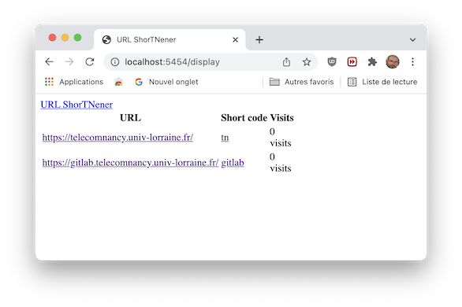
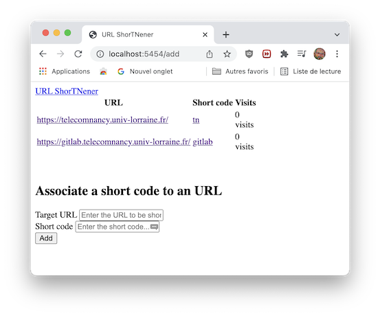
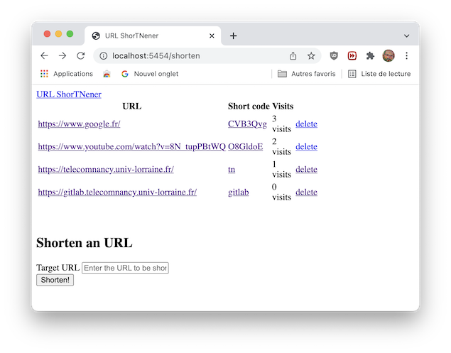
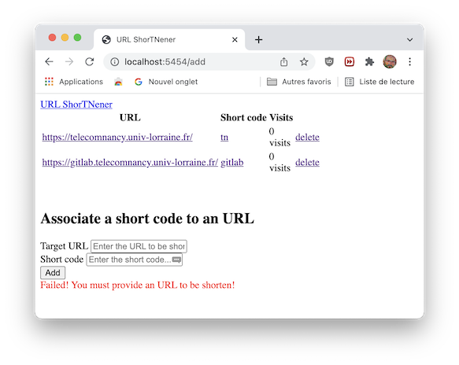

# Lab #Web2 - Web Programming


## Objectifs et Attendus

L'objectif de cette séance de travaux pratiques évaluées est de réaliser une application web offrant un service de réduction d'URL (URL shortener)


> *Le principe général de la réduction d'URL consiste à assigner une clé unique de quelques caractères à l'URL d'une page web spécifique. Un utilisateur désirant se rendre sur cette page web peut ensuite simplement fournir cette clé à la suite du nom de domaine du service de réduction, qui le redirige (redirection d'URL) alors vers la page appropriée.*
> 
> -- <cite>[Wikipedia - Article 'Réduction d'URL'](https://fr.wikipedia.org/wiki/R%C3%A9duction_d%27URL)</cite>


Autrement dit, votre application va permettre de saisir une URL vers une page web (par exemple, `https://gitlab.telecomnancy.univ-lorraine.fr/cs54-2k23/`), vous permettre de générer un code raccourci (par exemple, `XGF1doE`) et d'accéder à l'adresse d'origine en passant par l'URL plus courte (`http://localhost:5454/r/XGF1doE`).
Votre application assurera la génération des codes, la persistance de ces codes (et des URLs associées) dans une base de données relationnelles, la redirection de l'URL formée par le code vers l'URL d'origine. Elle tiendra également à jour le nombre de visite d'un lien raccourci. 


 
**Figure 1.** Capture d'écran d'un exemple de réalisation de l'application attendue.


### Mise en place de votre environnement

Il vous est demandé :

- de mettre en place un environnement virtuel pour votre développement.
- d'y installer les librairies dont vous avez besoin (a minima la librairie `Flask`)
- de sauvegarder la liste de vos dépendances dans un fichier `requirements.txt` (pour rappel, cela peut être réalisé en utilisant la commande `pip freeze > requirements.txt`).
- de penser à mettre à jour ce fichier de dépendances si vous installez plus tard d'autres dépendances.
- d'ajouter, de committer et de déposer (*pousser*) sur le serveur gitlab ce premier commit. 
  
> ⚠️ **Attention** Vous ne devez pas ajouter et committer le contenu du répertoire contenant votre environnement virtuel.


### Les bases de votre serveur web

Le code principal de votre serveur web devra se trouver dans un fichier Python dénommé `app.py`.

Nous devons être capables d'exécuter votre serveur en utilisant les commandes suivantes :
```bash
# creation d'un environnement virtuel spécifique à l'évaluation
$ python3 -m venv venv-eval --prompt evaluation
$ source venv-eval/bin/activate

# installation des dépendances
$ pip install -r requirements.txt

# exécution du serveur sur le port 8080 de l'hôte local
$ flask run --host=0.0.0.0 --port=5454
```


## Questions


**Question 1**
En utilisant la library Flask, écrire un serveur web qui lors de son exécution retournera la chaîne de caractères `Up and Running!` lorsque l'on effectue une requête HTTP `GET` sur la route `/status`.


**Question 2** 
Les données manipulées par votre serveur peuvent être assimilées à une liste contenant une URL cible (l'URL longue de la page web d'origine), un code correspondant au raccourci et une valeur entière correspondant au nombre de visite du lien.

Modifier votre serveur pour générer dynamiquement (en utilisant un *template*) une page HTML affichant les données gérées par l'application. Cette page sera servie lorsqu'un utilisateur effectue une requête `GET` sur la route `/display`.

La figure 2 illustre ce à quoi pourrait ressembler votre page HTML. Pour le moment le lien raccourci ne sera pas fonctionnel (mais cela doit bien être un lien hypertexte dans le rendu).



**Figure 2.** Capture d'écran d'un exemple de l'affiche des liens/raccourcis/compteur de visite.


Pour tester votre affichage, vous utiliserez les données exemples suivantes :
```python
data = [ 
    ('https://telecomnancy.univ-lorraine.fr/', 'tn', 42), 
    ('https://gitlab.telecomnancy.univ-lorraine.fr/', 'gitlab', 666) 
    ]
```


**Question 3**
Vous allez maintenant créer un modèle relationnel pour les données manipulées et instancier une base de données relationnelles SQLite. N'oubliez pas d'indiquer les contraintes d'intégrité sur vos relations.

Votre base sera conservée dans un fichier dénommé `short_urls.db` stocké à la racine de votre dépôt git (N'oubliez pas d'ajouter cette base à votre prochain commit).

Vous insérerez dans votre base les données de tests précédentes.

Vous sauvegarderez votre schéma relationnel dans un fichier texte dénommé `database_schema.txt` (Vous pouvez utilisez le contenu retourné la commande `.schema` de SQLite).


**Question 4**
Modifier votre application pour qu'une requête sur la route `/display` affiche maintenant les données contenue dans la base de données et non plus les données de tests.
  

**Question 5**
Votre application doit maintenant permettre d'accéder à un formulaire permettant d'ajouter un nouveau raccourci. Cette page sera accessible lors d'une requête `GET` sur la route `/add`.
Le formulaire doit contenir deux champs, l'un pour l'URL longue (dénommé `target_url`), et l'autre pour le code raccourci (dénommé `short_code`). Dans cette fonctionnalité, c'est l'utilisateur qui doit saisir le raccourci souhaité.



**Figure 3.** Capture d'écran d'un exemple de formulaire permettant l'ajout d'un raccourci.


La soumission du formulaire doit insérer les données dans la base de données. 
La page doit présenter la liste des URL/raccourcis déjà connu et le formulaire

On peut imaginer qu'après l'insertion, la liste des URLs est présentée à nouveau à l'utilisateur ainsi que le formulaire d'ajout.


**Question 6**
Votre application doit maintenant permettre d'accéder à un formulaire permettant d'ajouter un nouveau raccourci généré aléatoirement. Cette page sera accessible lors d'une requête `GET` sur la route `/shorten`.
Le formulaire doit contenir un champ pour l'URL longue (dénommé `target_url`).

Le code Python suivant doit vous permettre de générer aléatoirement des codes raccourcis de taille fixe. Libre à vous de l'utiliser ou non.
```python
alphabet = string.ascii_letters + string.digits
short_code = ''.join(random.choice(alphabet) for i in range(SHORTCODE_LENGTH))
```


**Figure 4.** Capture d'écran d'un exemple de formulaire permettant la génération automatique d'un raccourci.

La page doit présenter la liste des URL/raccourcis déjà connu et le formulaire


**Question 7**
Votre application doit maintenant être capable de rediriger un client lorsque celui-ci accède à une URL raccourci.
Les raccourcis seront gérés sur la route `/r/`. Ainsi, en utilisant les données exemples, l'accès à la route `/r/gitlab` devrait rediriger l'auteur de la requête sur l'URL associée `https://gitlab.telecomnancy.univ-lorraine.fr/`.

Modifier vos pages HTML (*templates*) pour que les liens hypertextes des raccourci soient corrects.


**Question 8**
Votre application doit maintenant être capable de compter les visites d'un lien raccourci (et de mettre à jour les compteurs dans la base de données) avant de rediriger un client lorsque celui-ci accède à une URL raccourci.


**Question 9**
Votre application doit maintenant permettre de supprimer un raccourci. Vous devez donc modifier vos pages d'affichage pour rajouter une telle fonctionnalité.


**Figure 5.** Capture d'écran illustrant la fonctionnalité de suppression des raccourcis (il s'agit ici de la page `/shorten`).


**Question 10**
Modifier votre application pour gérer quelques cas d'erreur :
- accès à une URL raccourcie inexistante (réponse `HTTP 404 Not Found` attendue)
- tentative d'ajout d'un code raccourci déjà utilisé ou bien envoi d'un formulaire vide (affichage d'un message d'erreur à l'utilisateur sur la page HTML retournée. Ce message **devra obligatoirement contenir la chaîne** `Failed`.
  



**Question 11**

Votre application n'est pas très jolie pour le moment.
Faites vous plaisir et ajouter du style ;)

Vous trouverez ci-dessous un exemple d'ajout de styles (comme toujours, les goûts et les couleurs ne se discutent pas).


### Vérification finale

Si vous êtes arrivé jusqu'ici, votre dépôt doit contenir a minima les fichiers suivants :

- [x] `requirements.txt`
- [x] `app.py`
- [x] `short_urls.db`
- [x] `database_schema.txt`
- [x] les fichiers de vos *templates* et de vos ressources statiques (CSS par exemple).

Bravo !

## Quelques liens utiles

- le serveur [gitlab : http://gitlab.telecomnancy.univ-lorraine.fr/](http://gitlab.telecomnancy.univ-lorraine.fr/) de l'école
- la [page du cours CS54](https://arche.univ-lorraine.fr/course/view.php?id=39557) sur Arche
- la [page officielle de la librairie Flask](https://flask.palletsprojects.com/en/2.2.x/)
- le [tutoriel officiel de la librairie Flask](https://flask.palletsprojects.com/en/2.2.x/tutorial/)

### Gestion de versions (git)

Il vous est demandé :

- de *cloner* le dépôt présent sur la plateforme GitLab de l'école pour travailler en local sur votre machine personnelle ou une machine de l'école
- de *committer* chacune de vos versions de vos programmes et de *pousser* **régulièrement** ces commits sur la plateforme GitLab

Prenez l'habitude d'associer à vos commits des messages pertinents qui décrivent le contenu des modifications apportées par le commit.

### Bonnes pratiques de développement

Vous veillerez à documenter/commenter le code Python que vous écrivez. Chaque fonction que vous définissez devrait être associée à commentaire pour préciser : le type et le sujet de chaque paramètre ; le type et la valeur de retour de la fonction ; les pré-conditions (et éventuellement post-conditions) de cette fonction.

Vous pouvez utiliser si vous le souhaitez :

- des [indications de types (*Type Hinting*)](https://docs.python.org/3/library/typing.html) disponibles depuis Python 3.5+ et définis dans la [PEP 484](https://www.python.org/dev/peps/pep-0484/). Ils vous permettent d'annoter des types à vos paramètres, valeur de retour ou encore variables.
- les [*docstrings* (PEP 257)](https://www.python.org/dev/peps/pep-0257/)
